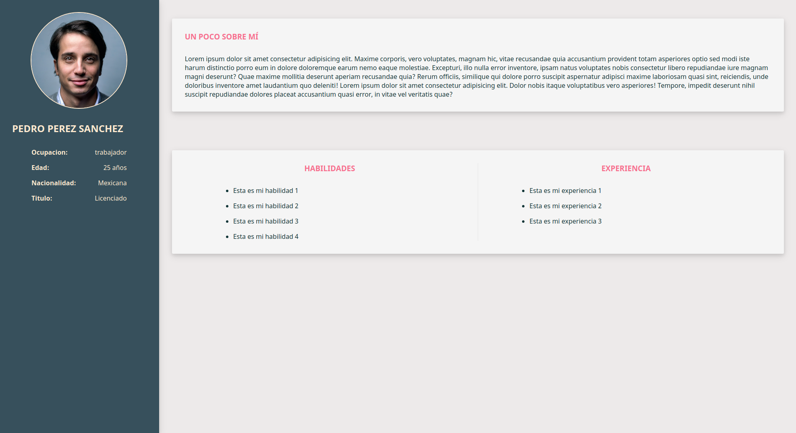

# Introducción HTML Y CSS

HTML es el lenguaje de marcado con el que se construyen todas las páginas web. CSS es el lenguaje para darle estilo a las páginas. En esta sesión aprenderemos cómo usar HTML y CSS para crear una página web estática desde cero. Veremos cómo crear, mediante código sencillo, elementos básicos como títulos, párrafos, listas, enlaces, imágenes, etc. y también cómo darles estilo para que luzcan atractivos. Solo es necesario tener un editor de texto y un navegador web.

---

## [Demo final](url_de_github_actions)



## Tecnologías

- HTML
- CSS

## Instalación

Descargar el repositorio a travez de el boton **Code** colo verde que se encuentra en la parte superior de esta página

ó

Clonar el repositorio

```
git clone https://github.com/FulanoD3Tal/curso-introduccion-html-css.git
```

Abrir el archivo **index.html** en un navegador entrando a cada carpeta según vayas avazando en el curso

En cada carpeta (exceptuando la primera) se encuentra la siguiente estructura de carpeta

```
-carpeta
    -inicial
    -final
```

Donde la carpeta **inicial** sería para seguir el ejercicio junto conmigo y la carpeta **final** contiene el codigo final con comentarios para aquellos que quieran prestar atención a la sesión
